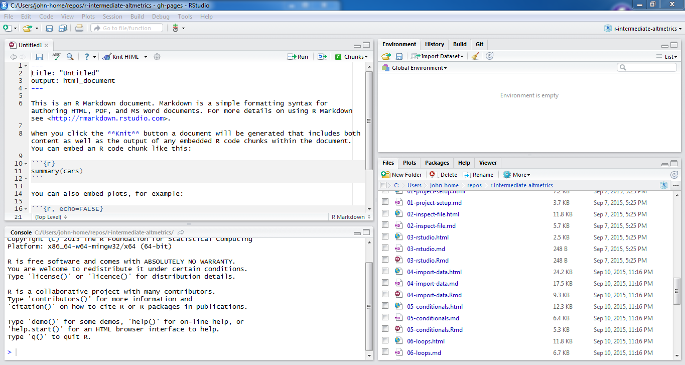
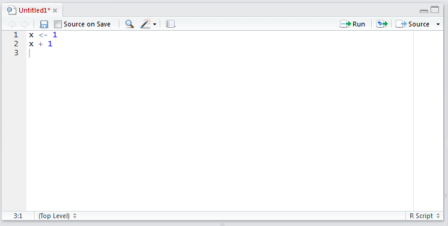
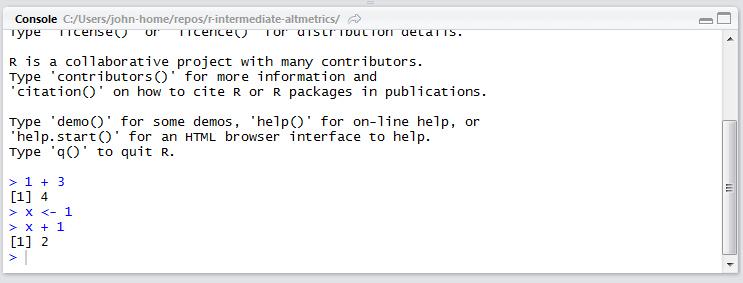
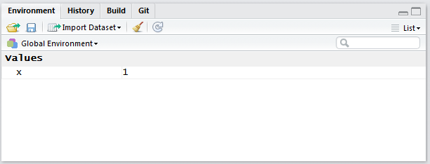
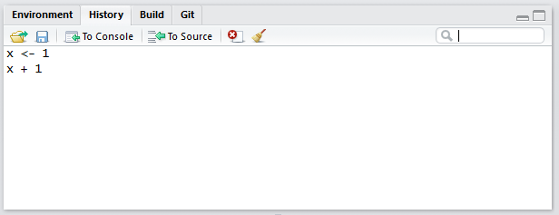
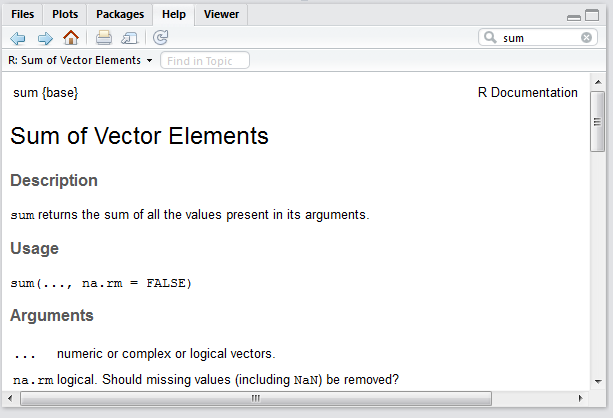
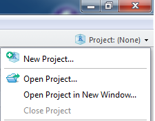
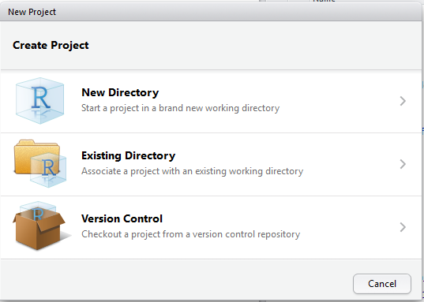
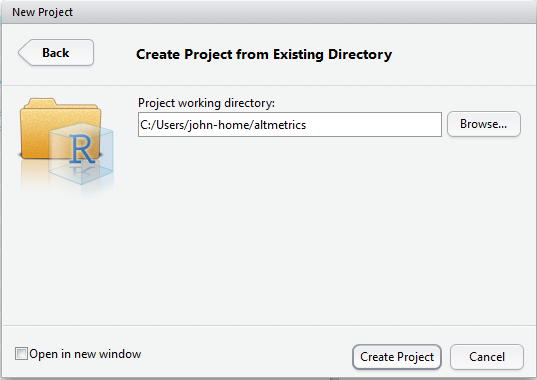

> ## Learning Objectives {.objectives}
>
> * Understand the different panels
> * Send code from file to console
> * Create RStudio project

We will use R via the interactive development environment (IDE) RStudio.
In this lesson we'll explore some of its useful features.

### The different panels

First, let's open a new R script in the text editor ("File" -> "New File" -> "R Script").
One of the biggest advantages of using RStudio is how easy it makes to test new code your write.
Let's write a few lines of code in the text editor.

By clicking on the button that says "Run", we can send a line from the script to the Console to be executed.
If we highlight multiple lines of code, all these lines will be run in the Console.
As a shortcut, you can press "Ctrl-Enter" instead of clicking on the "Run" button.

The R Console works the same as if you accessed R from the Unix shell or the Windows R GUI.
Recall that the up and down arrows browse through past commands.

The Environment panel describes all the objects present in the R session.
It is similar to `ls`, but gives additional details like what is stored in the object.

The History panel displays all the past commands that were run in the Console.
These past commands can be selected and then sent either to the script ("Source") or to the Console to be run again.

The Files panel shows all the available files available in the current working directory.

The Help panel shows the documentation for R functions.
We can either run `?` in front of the function name to bring up the documentation, e.g. `?sum`.
Alternatively, we can put the cursor on the name of the function and press the F1 key.

Lastly the Plots panel will display any graphs we create and the Packages panel shows which packages have been installed.

### Creating an RStudio project

To organize our project, we will create an RStudio project.
RStudio projects are convenient for many reasons.
When you open an RStudio project,
the working directory in the Console is automatically set to the project directory (i.e. we don't have to run `setwd`),
the Files panel shows all the files for the project,
and any files that were open in the editor the last time will be opened.
Furthermore, we can configure settings specific to each project, though we won't go into those details in this lesson.

To create an RStudio project, go to the top right of the screen and click on the "Project" button.
Then select "New Project".

Since we already created a project directory in the Unix shell lesson, choose to create a project in an "Existing Directory".

Click on "Browse" and find the `altmetrics` directory we created earlier.

And that's it.
Now we have an RStudio project.
The next time we open RStudio, we can open the project and RStudio will prepare everything for us to start working.

> ## Opening an existing RStudio project {.challenge}
>
> Close RStudio and reopen it.
> In the Console run `getwd`.
> It should display your home folder.
> Now open the altmetrics project and run `getwd` again.
> The working directory should have changed to the`altmetrics` directory.
