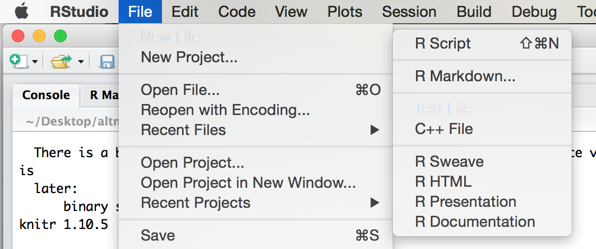

> ## Learning Objectives {.objectives}
> Learn how to write documents using Markdown syntax. 

So far, we've written a README.txt file for our project, which is just plain text.
There's nothing wrong with a plain text README, but we can spice it up a little. 
In this lesson, we'll learn the basics of Markdown syntax. 
Markdown is a language that provides some basic text upgrades over just plain text when rendered, including bolding and italicizing text.
Understanding the basics of writing in Markdown will be helpful for the next few lessons, when we go over the basics of writing reports using R Markdown. 

To make sure we can get started, let's make sure everyone has the knitr package installed:


```r
install.packages('knitr')
```

Let's make a new README file for the almetrics project using the markdown language.
Make sure the working directory for R Studio is set to  the altmetrics folder by going to `Session` -> `Set Working Directory` -> `Choose Directory`, and navigate to the altmetrics directory.

Now let's start our new README document. 
Go up to `File` -> `New File` -> `Text File`. 



This opens an untitled document that you can see is just blank.

Before we get started, let's save it as our README file in the altmetics directory. 
Go to `File` -> `Save As`, and call the file README.md. 
The file ending .md indicates that it is a markdown file. 

Let's start adding some information to our file:

```
README

9/17/15 Emily Davenport

This directory contains information from the altmetrics study. 
```

Once that is entered, click on the `Preview HTML` button.
A page should pop up that displays our short README file. 

This is fine, but let's start adding some flash. 
First, let's make the first line a header. 
To make headers in Markdown, you can use varying numbers of hashtags at the beginning of a line. 
The fewer the hashtags, the larger the font. 

Put varying numbers of hashtags in front of README and click `Preview HTML`. 
Figure out which header size you like most and update that file to have that header. 

Your file should now look something like this:

```
# README

9/17/15 Emily Davenport

This directory contains information from the altmetrics study. 
```

New paragraph spacing works a bit differently in Markdown than what you may be used to. 
Let's add some additional information about what is included in this folder, with the intention of having each entry on a new line:

```
# README

9/17/15 Emily Davenport

This directory contains information from the altmetrics study, including:
data files
scripts
results
```

That's not what we wanted.
To indicate you want to start on a new line, you need to put two spaces at the end of the current line.
Go back and add two spaces after including, data files, scripts, and results.

```
# README

9/17/15 Emily Davenport

This directory contains information from the altmetrics study, including:  
data files  
scripts  
results  
```

It may seem odd that a return doesn't create a line break, but we'll see why this might be beneficial during the version control section. 
If you hit the return button twice, it will create a paragraph break with white space. 

It would look a bit nicer if our list had bullet points in front of each entry rather than just being on a new line. 
Using Markdown, you can indicate list entries using either "-", "+", or "*" in front of each item. 
In our script, add a return after the "including:" and add asterisks in front of each item in our list. 
Generate the HTML to see our formatted list. 

```
# README

9/17/15 Emily Davenport

This directory contains information from the altmetrics study, including:

*  data files  
*  scripts  
*  results  
```

You can also include asterisks or underlines on either side of selections you want to bold or underline, respectively.
Let's bold the word altmetrics, and italicize including:


```
# README

9/17/15 Emily Davenport

This directory contains information from the **altmetrics** study, _including_:

*  data files  
*  scripts  
*  results  
```

You can also include code boxes in Markdown, which will designate to the reader what exactly to run. 
Anything between two backticks (located under the tilde on your keyboard) will be rendered as a code block.
Let's include a code box in the README about how to view the README. 

```
# README

9/17/15 Emily Davenport

This directory contains information from the **altmetrics** study, _including_:

*  data files  
*  scripts  
*  results  

To view this README, type `cat README.md`.
```

We've now generated a slightly more stylized version of a README using Markdown.
Markdown needs to be rendered into HTML to properly be viewed and today we used RStudio to do that. 
The plus of using a language like Markdown to spruce up your text files is that it is still very readable through all of the Markdown syntax.
Even if the document is not rendered, you can view this file on your computer and easily read through it. 
