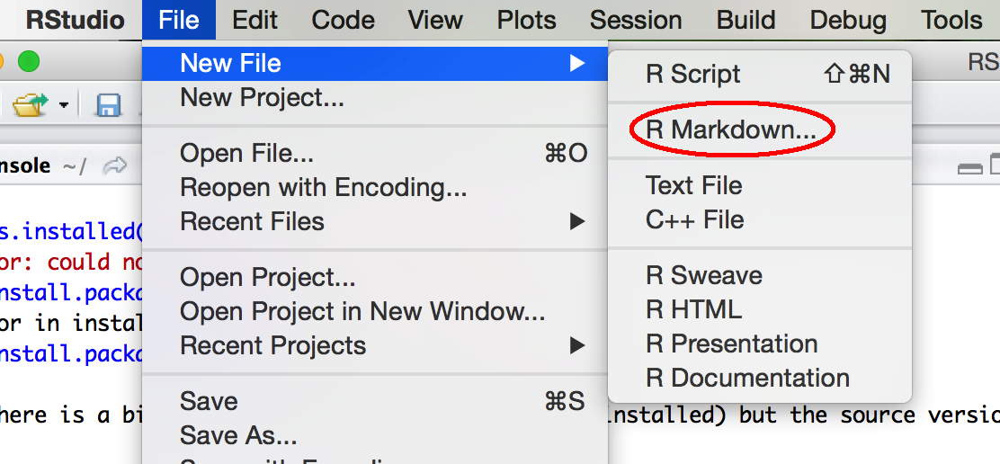
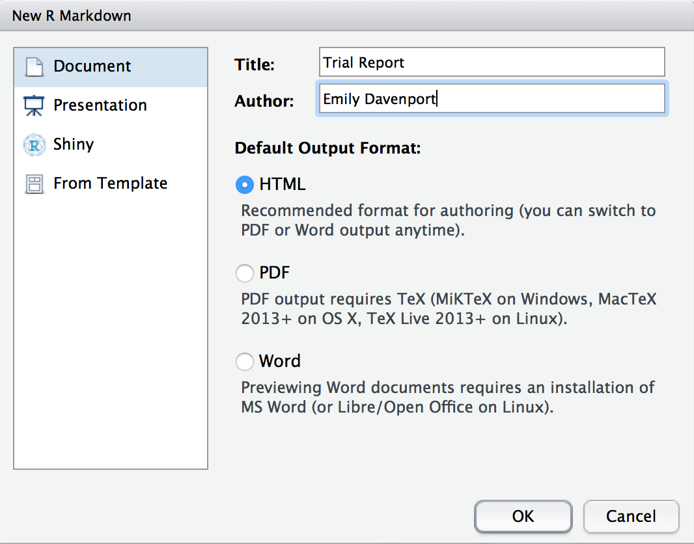
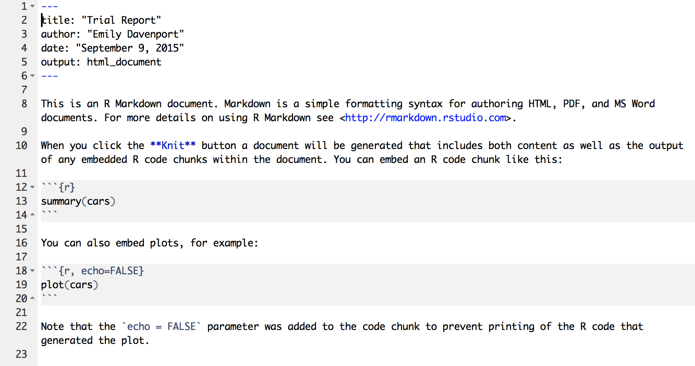

> ## Learning Objectives {.objectives}
> Learn how to generate reproducible reports that display your code and results. 

When you perform wet lab experiments, what information do you put in your lab notebook? 
You probably include the protocol you used to run the experiment, information about the samples and reagents used in the protocol, and at the end you'll likely include your results (for instance, a picture of a gel). 
This essentially creates a report of your experiment.  

You can do the same with your dry lab analyses using a tool called R Markdown. 
Why would we want to do this?  

*  Your method, results, and interpretation are stored in one place  
*  If you update your methodology, you can easily update your results with the click of a button, rather than copying and pasting.   
*  You _could_ cut and paste your code and results into Word or Power Point, but that will make rerunning your code challenging, as Word often introduces hidden characters.  

R Markdown is a fairly simple language you can use to generate reports that incorporate bits of R code along with the output they produce.
There are two steps to generating reports with R Markdown and RStudio:

1) Write your code in R Markdown.
2) Assemble your report as either HTML or a PDF using the package knitr.  


Next, let's run through the demo for knitr to see some of the options.
Go up to `File` -> `New File` -> `R Markdown`. 




A screen will pop up asking us what kind of document we wish to create.
Let's name our demo report "Trial Report" and fill in your name.
Ensure that "Document" is highlighted to the left and that "HTML" is chosen.
Click "Ok".



Now we have the example R Markdown file open. 
The first thing you'll notice at the top is a header which includes your name, the title of the document, the date, and a field called output. 
This header tells the package knitr some information it might need about your document, including what format you want the final report rendered in. 

The next thing you'll notice is white space with some text describing an R Markdown document. 
White space in this document represents text of the report you would like to display. 
You can put anything here describing your analysis, results, etc. and it will be recognized as text and not R code.
This white space is interpreted as Markdown language, so you can use any of the tricks we learned in the last lesson to make lists, bold certain words, or create headers in your document. 

In this trial script, you'll see some of these markdown elements are used. For example, the word knit is in bolded (using asterisks), and there are code chucks near the bottom that say echo = FALSE. 



In addition to the white space, you'll gray blocks that have ``` at the top and bottom. 
These are called chunks. 
If the start of a chunk has {r} at the end of the ticks, knitr will recognize the code in that chunk as R code and run it when rendering the HTML.
In your R Markdown, the code will look like:

<pre><code>```{r}
summary(cars)
```</code></pre>

In your final report, the code will look like:


```r
summary(cars)
```

```
##      speed           dist       
##  Min.   : 4.0   Min.   :  2.00  
##  1st Qu.:12.0   1st Qu.: 26.00  
##  Median :15.0   Median : 36.00  
##  Mean   :15.4   Mean   : 42.98  
##  3rd Qu.:19.0   3rd Qu.: 56.00  
##  Max.   :25.0   Max.   :120.00
```


Let's add a new chunk to end this demo document. 
To do so, either you can enter three backticks in a row, followed by {r}, or you can click on the green `Chunks` button and chose `Insert Chunk`.
Additionally, there's a keyboard short cut which is `ctrl`+`alt`+`i` which will also pop up a chunk in an R Markdown document. 


In the chunk, let's just examine the dimensions of the `car` dataset:

<pre><code>```{r}
dim(cars)
```</code></pre>

You can actually send the code straight from the chunks over to console to be evaluated in two ways. 
First, you can highlight the code you want to run in the chunk and hit the `Run` button, which is located in the top right corner of the pane.
Additionally, you can use the keyboard shortcut `ctrl`+`alt`+`c` (if you're using Windows/Linux) or `command`+`option`+`c` (if you're using a Mac).
This allows you to iteratively write an test code in RStudio, rather than having to render the full report everytime you at a bit of new code.

These are the basics of writing R Markdown, but we still need to generate a report. 
To do this, click on the button on the top bar that says "Knit HMTL". 
This will prompt you to save the file. 
Go ahead and save this file as `Rmarkdown_demo.Rmd` in the altmetrics directory. 
The ending of the file `.Rmd` indicates that this is an R Markdown file. 


When you click on this link, you see in the console that RStudio is running and rendering your R Markdown file. 
What is actually happening is RStudio is running the function `render`, which is part of the `rmarkdown` package. 
There are two things the command render does. 
First, it converts the R Markdown file to a Markdown file using the command `knit` from the `knitr` package (hence why rendering is called knitting).
The second step is then the Markdown file is converted to the final file format (HTML, PDF, or Word).

The final result is that an HMTL file will pop up where you'll see the report. 
You can see the header has been rendered, there are code and results chunks displayed, and even plots are shown right in the report. 

Also, if you now look in the altmetrics folder, you'll see an HTML file of the name Rmarkdown_demo.html.
When knitr is run, it saves the current version of the .Rmd file and the generated HTML file in the directory it is stored in. 
